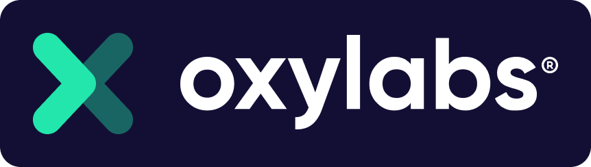

    

<h2 align="center">
  Oxylabs Scraper APIs
</h2>

Oxylabs’ Scraper APIs are public data scrapers that provide real-time information from major search engines, over a 1000 e-commerce websites, and other difficult to scraper targets.

## Navigation Key

- [Features](#features)
- [How Scraper APIs works](#how-scraper-apis-works)
- [Getting started](#getting-started)
- [Integrations](#integrations)
- [Contacts](#contacts)

## Features

- 100% success rates
- Location and device-specific requests
- Results parsing (in JSON) for selected targets
- JavaScript rendering
- Adaptive parsing
- Website changes handling
- Patented proxy rotator
- Session control

 
## How Scraper APIs works

Scraper APIs are easy to use and don't require any specific infrastructure or resources from your end:

  1. Send a request to any of the Scraper APIs
  2. Scraper APIs collect the required information from your target
  3. Receive ready-to-use web data

## Getting started

  1. [Create an Oxylabs account](https://dashboard.oxylabs.io/registration)
  2. Choose Scraper APIs as the desired product
  3. Claim your free trial
  4. Start scraping

For a detailed guide on how to implement and start using Scraper APIs, check out our [quick start guides](https://oxylabs.io/resources/start-guides)

## Integrations

- [C#](https://github.com/oxylabs/product-integrations/tree/master/scraper-apis/CSharp)
- [Java](https://github.com/oxylabs/product-integrations/tree/master/scraper-apis/Java)
- [Node.js](https://github.com/oxylabs/product-integrations/tree/master/scraper-apis/Nodejs)
- [Typescript](https://github.com/oxylabs/product-integrations/tree/master/scraper-apis/Typescript)
- [PHP](https://github.com/oxylabs/product-integrations/tree/master/scraper-apis/PHP)
- [Python](https://github.com/oxylabs/product-integrations/tree/master/scraper-apis/Python)
- [Golang](https://github.com/oxylabs/product-integrations/tree/master/scraper-apis/GoLang)

## Contacts
Email - hello@oxylabs.io
 <a href="https://oxylabs.drift.click/oxybot">Live chat</a>
